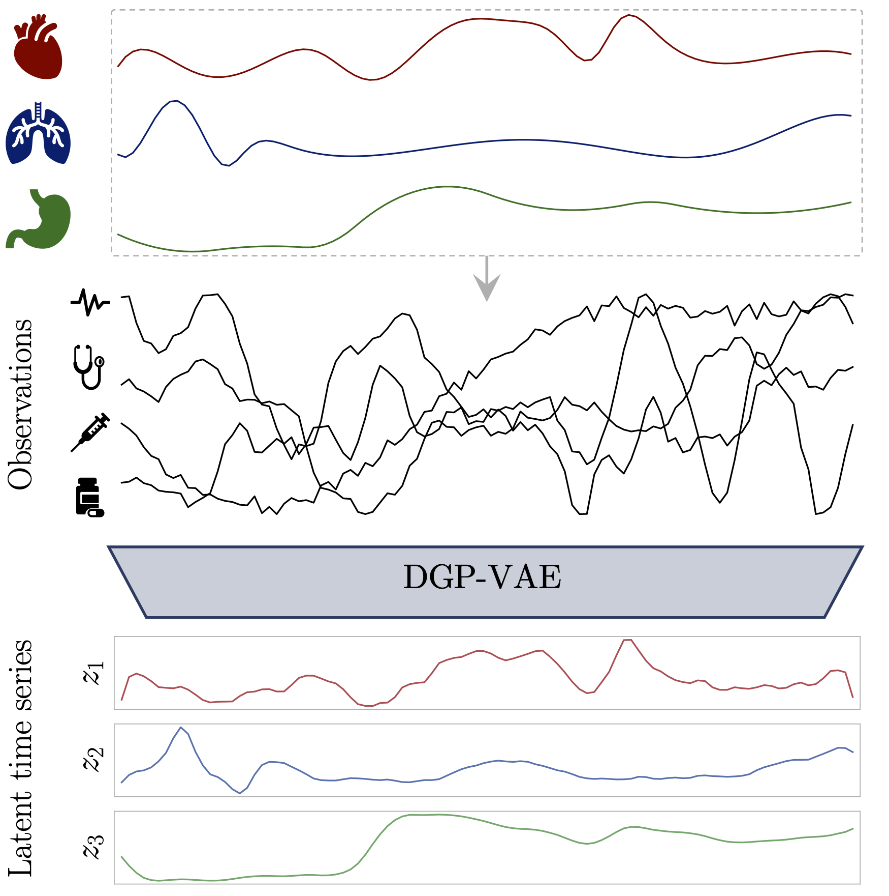

# DGP-VAE: Disentangled GP-VAE
Tensorflow implementation of the DGP-VAE model. 
Accompanying code for our paper.

## Overview
We investigate the performance of a [GP-VAE](http://arxiv.org/abs/1907.04155) type model to learning
disentangled representations from time series by providing a slightly modified model: the DGP-VAE.

Our model learns disentangled representations from sequential data 
by modeling each independent latent channel with a Gaussian Process and employing
a structured variational distribution that can capture long-term dependencies in time.

We show the efficacy of our approach in two experiments:

1) A benchmark experiment comparing against state-of-the-art disentanglement models on synthetic data.

2) An experiment on real medical time series data, where we provide a detailed comparison 
with the state-of-the-art model for disentanglement that can exploit the structure of sequential data.

## Dependencies

* Python >= 3.6
* TensorFlow = 1.15
* disentanglement_lib (Available [here](https://github.com/google-research/disentanglement_lib))
* Some more packages: see `requirements.txt`

## Run
1. Clone or download this repo. `cd` yourself to its root directory.
2. Grab or build a working python enviromnent. [Anaconda](https://www.anaconda.com/) works fine.
3. Install dependencies, using `pip install -r requirements.txt`
4. Clone or download the disentanglement_lib and add its root directory to your `PYTHONPATH`.
5. Download data:
    1. Synthetic data: First, download the underlying factors of variation by running `data/load_{dsprites, smallnorb, cars3d, shapes3d}.sh`.
    Then synthesize the actual data set from these factors by running `python data/create_dataset.py --data_type {dsprites, smallnorb, cars3d, shapes3d}`.
    2. Real medical data: Download the [HiRID data set](https://hirid.intensivecare.ai/HiRID-high-time-resolution-ICU-data-set-9834a14b9b894b7d8365f1301a13afaa)
    and save the Parquet partitons of the `merged` stage of the pre-processed data in a directory.
    To create the training data from the partitions, run `python create_hirid.py --hirid_merged_dir /path/to/hirid/partitions`.
    Finally, to download the assignment matrix required for the DCI score calculation, run 
    `data/load_hirid_assign.sh`.
6. Run the command `python run_experiment.py --model_type dgp-vae --data_type {dsprites, smallnorb, cars3d, shapes3d, hirid} 
--exp_name <your_name> ...`

 

   
To see all available flags run: `python train.py --help`

## Reproducibility
The exact hyperparameters used for the experiments are reported in our paper.
To reproduce our final results run the following commands:

* dSprites, SmallNORB, Cars3D, Shapes3D: `python run_experiment.py --model_type dgp-vae 
--data_type {dsprites, smallnorb, cars3d, shapes3d} --time_len 5 --testing --batch_size 32 
--exp_name reproduce_{dsprites, smallnorb, cars3d, shapes3d} --seed $RANDOM --banded_covar 
--latent_dim 64 --encoder_sizes=32,256,256 --decoder_sizes=256,256,256 --window_size 3 
--sigma 1 --length_scale 2 --beta 1.0 --data_type_dci {dsprites, smallnorb, cars3d, shapes3d} 
--shuffle --save_score --visualize_score`

* HiRID: `python run_experiment.py --model_type dgp-vae --data_type hirid --time_len 25 --testing --batch_size 64 
--exp_name reproduce_hirid --seed $RANDOM --banded_covar --latent_dim 8 --len_init scaled 
--kernel_scales 4 --encoder_sizes=128,128 --print_interval 1 --decoder_sizes=256,256 
--window_size 12 --sigma 1.005 --length_scale 20.0 --beta 1.0 --shuffle --data_type_dci hirid 
--save_score --visualize_score`
  
